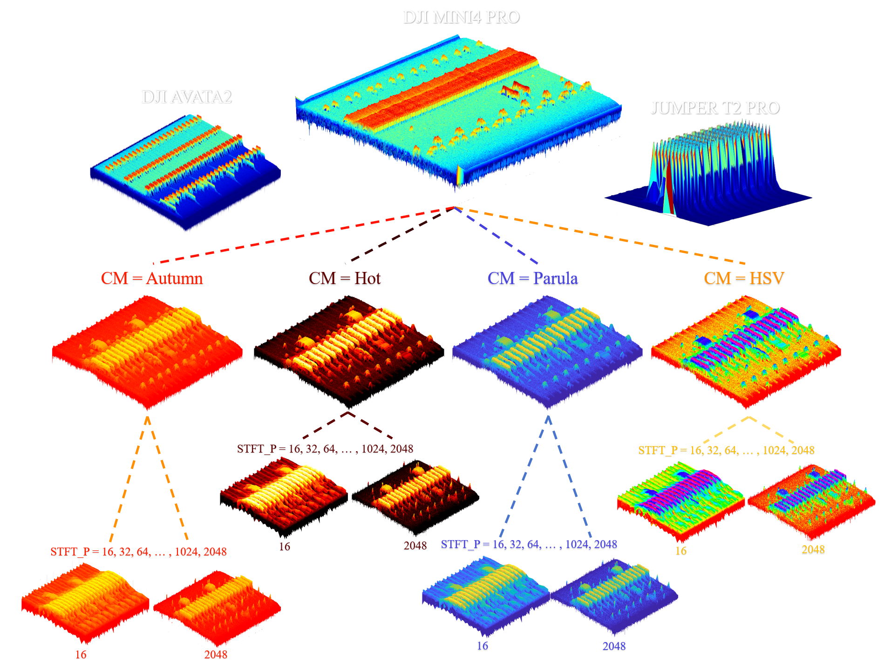

<!-- 深色主题切换功能 -->
<div style="position: fixed; top: 20px; right: 20px; z-index: 1000;">
  <button id="theme-toggle" style="padding: 10px 20px; border: none; border-radius: 5px; cursor: pointer; background-color: #f0f0f0; color: #333333; font-size: 14px; box-shadow: 0 2px 5px rgba(0,0,0,0.2);">
    ☀️ 切换到浅色模式
  </button>
</div>

<div id="theme-notice" style="position: fixed; top: 70px; right: 20px; z-index: 999; background-color: #1e3a5f; color: #b3d9ff; padding: 12px 16px; border-radius: 5px; border-left: 4px solid #4a9eff; max-width: 300px; font-size: 13px; box-shadow: 0 2px 8px rgba(0,0,0,0.15); display: none;">
  💡 <strong>提示：</strong>当前为深色模式，已获得最佳浏览体验！
</div>

<style>
  :root {
    --bg-color: #1e1e1e;
    --text-color: #d4d4d4;
    --code-bg: #2d2d2d;
    --code-text: #ce9178;
    --border-color: #3e3e3e;
    --blockquote-bg: #252526;
    --link-color: #4ec9b0;
  }

  [data-theme="light"] {
    --bg-color: #ffffff;
    --text-color: #333333;
    --code-bg: #f4f4f4;
    --code-text: #e83e8c;
    --border-color: #e1e4e8;
    --blockquote-bg: #f6f8fa;
    --link-color: #0366d6;
  }

  html {
    background-color: var(--bg-color);
    transition: background-color 0.3s ease, color 0.3s ease;
  }

  body {
    background-color: var(--bg-color);
    color: var(--text-color);
    transition: background-color 0.3s ease, color 0.3s ease;
  }

  pre, code {
    background-color: var(--code-bg) !important;
    color: var(--code-text) !important;
  }

  a {
    color: var(--link-color);
  }

  blockquote {
    background-color: var(--blockquote-bg);
    border-left-color: var(--border-color);
  }

  #theme-notice[data-theme="light"] {
    background-color: #fff3cd;
    color: #856404;
    border-left-color: #ffc107;
  }
</style>

<script>
  (function() {
    // 默认使用深色模式
    const savedTheme = localStorage.getItem('theme') || 'dark';
    
    // 应用主题
    function applyTheme(theme) {
      document.documentElement.setAttribute('data-theme', theme);
      localStorage.setItem('theme', theme);
      
      const button = document.getElementById('theme-toggle');
      const notice = document.getElementById('theme-notice');
      
      if (theme === 'dark') {
        button.textContent = '☀️ 切换到浅色模式';
        button.style.backgroundColor = '#f0f0f0';
        button.style.color = '#333333';
      } else {
        button.textContent = '🌙 切换到深色模式';
        button.style.backgroundColor = '#2d2d2d';
        button.style.color = '#ffffff';
      }
      
      notice.setAttribute('data-theme', theme);
    }
    
    // 初始化主题
    applyTheme(savedTheme);
    
    // 切换主题
    document.getElementById('theme-toggle').addEventListener('click', function() {
      const currentTheme = document.documentElement.getAttribute('data-theme');
      const newTheme = currentTheme === 'dark' ? 'light' : 'dark';
      applyTheme(newTheme);
    });
    
    // 显示提示（仅在首次访问时）
    if (!localStorage.getItem('theme-notice-shown')) {
      setTimeout(function() {
        const notice = document.getElementById('theme-notice');
        notice.style.display = 'block';
        setTimeout(function() {
          notice.style.display = 'none';
          localStorage.setItem('theme-notice-shown', 'true');
        }, 5000);
      }, 1000);
    }
  })();
</script>

<h1 style="text-align:center;"> RFUAV 数据集 </h1>

<div style="text-align: center; margin: 10px 0;">
  <a href="readme.md" style="text-decoration: none; color: var(--link-color); font-size: 16px;">📖 English Version / 英文版</a>
</div>

## 摘要

这是我们的论文 *"[RFUAV: A Benchmark Dataset for Unmanned Aerial Vehicle Detection and Identification](https://arxiv.org/abs/2503.09033)"* 的官方代码仓库。RFUAV 提供了一个全面的基于射频（RF）的无人机检测和识别基准数据集。
  


除了数据集之外，我们还提供了用于生成频谱信息的原始数据，包括在高信噪比（SNR）条件下记录的35种不同类型无人机的数据。该数据集可供所有从事RF数据分析的研究人员使用。研究人员可以应用我们提供的深度学习方法，或使用传统的信号处理技术，如解码、解调和FFT。

数据集的详细信息，包括文件大小（每个无人机的总数据量）、SNR（每个数据集的最高SNR）和中频（每个无人机数据采集时使用的中心频率），如下图所示。

  

我们分析了数据集中每个无人机的特性，包括跳频信号带宽（FHSBW）、跳频信号持续时间（FHSDT）、视频传输信号带宽（VSBW）、跳频信号占空比（FHSDC）和跳频信号模式周期（FHSPP）。这些特性的分布如下图所示。更多详细信息可以在我们的论文中找到。

  

使用RFUAV，您可以直接在原始IQ数据上实现无人机信号检测和识别，如下所示：
    <div style="text-align:center;">
        
    </div>

## 1. 快速开始

<details>
<summary>安装</summary>

```bash
pip install -r requirements.txt
```

</details>

<details>
<summary>运行无人机分类推理</summary>

```bash
python inference.py
```

</details>

<details>
<summary>使用ResNet50在小数据集上进行快速训练</summary>

```bash
python train.py
```

</details>

## 2. 使用说明

### SDR 回放

由于我们的数据是直接使用USRP设备采集的，因此与USRP和GNU Radio完全兼容，可用于信号回放。您可以使用我们的原始数据通过无线电设备广播信号以实现您想要的结果。此外，我们还提供了在实验中使用示波器观察到的回放结果以供参考。
    <div style="text-align:center;">
        
    </div>

### 2.1 将原始频率信号数据转换为频谱图

#### Python 流水线

我们提供了一个信号处理流水线，可以使用MATLAB和Python工具箱将二进制原始频率信号数据转换为频谱图格式。

**可视化频谱图**

您可以使用以下代码轻松可视化特定数据包的频谱图。`oneside` 参数控制是显示半平面还是全平面频谱图。

```python
from graphic.RawDataProcessor import RawDataProcessor

datapack = '您的数据包路径'
test = RawDataProcessor()
test.ShowSpectrogram(data_path=datapack,
                     drone_name='DJ FPV COMBO',
                     sample_rate=100e6,
                     stft_point=2048,
                     duration_time=0.1,
                     oneside=False,
                     Middle_Frequency=2400e6)
```

**批量转换为图像**

自动将原始频率信号数据转换为频谱图并保存为PNG图像：

```python
from graphic.RawDataProcessor import RawDataProcessor

data_path = '您的数据包路径'
save_path = '您的保存路径'
test = RawDataProcessor()
test.TransRawDataintoSpectrogram(fig_save_path=save_path,
                                 data_path=data_path,
                                 sample_rate=100e6,
                                 stft_point=1024,
                                 duration_time=0.1)
```

**保存为视频**

您可以使用 `TransRawDataintoVideo()` 方法将频谱图保存为视频，这样可以更好地可视化信号的时间演化：

```python
from graphic.RawDataProcessor import RawDataProcessor

data_path = '您的数据包路径'
save_path = '您的保存路径'
test = RawDataProcessor()
test.TransRawDataintoVideo(save_path=save_path,
                           data_path=data_path,
                           sample_rate=100e6,
                           stft_point=1024,
                           duration_time=0.1,
                           fps=5)
```

**瀑布频谱图**

`waterfall_spectrogram()` 函数将原始数据转换为瀑布频谱图视频，直观地显示信号在原始数据中如何随时间演化：

```python
from graphic.RawDataProcessor import waterfall_spectrogram

datapack = '您的数据包路径'
save_path = '您的保存路径'
images = waterfall_spectrogram(datapack=datapack,
                               fft_size=256,
                               fs=100e6,
                               location='buffer',
                               time_scale=39062)
```

#### MATLAB 流水线

您可以使用 `check.m` 程序可视化特定数据包的频谱图：

```matlab
data_path = '您的数据包路径';
nfft = 512;
fs = 100e6;
duration_time = 0.1;
datatype = 'float32';
check(data_path, nfft, fs, duration_time, datatype);
```

### 2.2 SNR 估计和调整

我们提供使用MATLAB工具箱的SNR估计和调整工具，帮助您分析和处理二进制原始频率信号数据。

**SNR 估计**

首先，定位信号位置并估计SNR：

```matlab
[idx1, idx2, idx3, idx4, f1, f2] = positionFind(dataIQ, fs, bw, NFFT);
snr_esti = snrEsti(dataIQ, fs, NFFT, f1, f2, idx1, idx2, idx3, idx4);
```

**SNR 调整**

`awgn1` 函数根据SNR估计结果调整原始信号数据的噪声水平。信噪比可以在-20 dB到20 dB之间调整，默认步长为2 dB。如果需要，您也可以定义自定义范围。

### 2.3 训练自定义无人机分类模型

我们提供基于PyTorch框架的无人机识别任务自定义训练代码。目前支持的模型包括 [ViT](https://arxiv.org/abs/2010.11929)、[ResNet](https://arxiv.org/abs/1512.03385)、[MobileNet](https://arxiv.org/abs/1704.04861)、[Swin Transformer](https://arxiv.org/abs/2103.14030)、[EfficientNet](https://arxiv.org/abs/1905.11946)、[DenseNet](https://arxiv.org/abs/1608.06993)、[VGG](https://arxiv.org/abs/1409.1556) 以及许多其他模型。您也可以使用 `utils.trainer.model_init_()` 中的代码自定义您自己的模型。

**训练**

要自定义训练，请创建或修改扩展名为 `.yaml` 的配置文件，并在训练代码中指定其路径。您可以调整 `utils.trainer.CustomTrainer()` 中的参数以实现所需的训练设置：

```python
from utils.trainer import CustomTrainer

trainer = CustomTrainer(cfg='您的配置文件路径')
trainer.train()
```

或者，您可以直接使用基础训练器：

```python
from utils.trainer import Basetrainer

trainer = Basetrainer(
    model='resnet50',
    train_path='您的训练数据路径',
    val_path='您的验证数据路径',
    num_class=23,
    save_path='您的保存路径',
    weight_path='您的权重路径',
    device='cuda:0',
    batch_size=32,
    shuffle=True,
    image_size=224,
    lr=0.0001
)
trainer.train(num_epochs=100)
```

**推理**

我们提供了一个推理流水线，允许您在频谱图图像或二进制原始频率数据上运行推理。处理二进制原始频率数据时，结果会自动打包成视频，并在频谱图上显示识别结果。**注意：** 在二进制原始频率数据上进行推理时，必须使用在频谱图数据集上训练的模型权重。

```python
from utils.benchmark import Classify_Model

test = Classify_Model(cfg='您的配置文件路径',
                      weight_path='您的权重路径')

test.inference(source='您的目标数据路径',
               save_path='您的目标保存路径')
```

### 2.4 训练自定义无人机检测模型

我们提供用于无人机检测任务的自定义训练方法。目前支持的模型包括 [YOLOv5](https://github.com/ultralytics/yolov5)。

**训练**

您可以使用以下代码训练YOLOv5模型进行无人机检测：

```python
from utils.trainer import DetTrainer

model = DetTrainer(cfg='您的配置文件路径', dataset_dir="您的数据集文件路径")
model.train()
```

**推理**

推理流水线允许您在频谱图图像或二进制原始频率数据上运行模型。处理二进制原始频率数据时，结果会自动打包成视频，并在频谱图上显示检测结果。**注意：** 在二进制原始频率数据上进行推理时，必须使用在频谱图数据集上训练的模型权重。

```python
from utils.benchmark import Detection_Model

test = Detection_Model(cfg='您的配置文件路径',
                       weight_path='您的权重路径')
test.inference(source='您的目标数据路径',
               save_dir='您的目标保存路径')
```

### 2.5 两阶段检测和分类

我们提供了一个结合检测和分类的两阶段流水线：第一阶段检测无人机信号，第二阶段对检测到的信号进行分类。您可以直接处理原始数据包，结果将保存为带有检测和分类注释的视频。

```python
from utils.TwoStagesDetector import TwoStagesDetector

cfg_path = '../example/two_stage/sample.json'
TwoStagesDetector(cfg=cfg_path)
```

**注意：** 您应该以 `.json` 格式指定配置文件。在配置文件中，您可以自定义检测和分类阶段使用的模型以获得更好的性能。该流水线支持优化的并行处理和数据复用，以实现高效的原始数据处理。

### 2.6 在基准测试上评估模型

您可以使用mAP、Top-K准确率、F1分数（宏平均和微平均）和混淆矩阵等指标在基准测试上评估您的模型。评估分别在SNR级别从-20 dB到20 dB的数据集上进行，最终模型性能在不同信噪比下报告。

```python
from utils.benchmark import Classify_Model

test = Classify_Model(cfg='您的配置文件路径',
                      weight_path='您的权重路径')

test.benchmark()
```

### 2.7 数据集处理的有用工具

**数据分割**

您可以根据需要直接访问我们的原始数据进行处理。我们提供了一个MATLAB工具（`tools/rawdata_crop.m`）用于分割原始数据。您可以指定任何原始数据段以固定间隔（例如，每2秒）进行分割。分割后的数据包更小，更易于处理。

**数据增强**

基准测试包括各种SNR级别下的无人机图像，而训练集仅包含原始SNR下的无人机图像数据。直接使用训练集可能会导致模型在基准测试上表现不佳。为了解决这个问题，我们提供了一个数据增强工具（`utils.preprocessor.data_augmentation`）来提高模型的准确性和鲁棒性：

```python
from utils.preprocessor import data_augmentation

data_path = "您的数据集路径"
output_path = "您的输出路径"
method = ['Aug_method1', 'Aug_method2', ...]

data_augmentation(dataset_path=data_path,
                  output_path=output_path,
                  methods=method)
```

## 3. 注意事项

### 3.1 原始数据参数说明

目前公开可用的数据集只是一个子集，包括37个无人机原始数据片段和我们在实验中使用的图像数据。

在数据采集期间为每种无人机类型配置的USRP参数记录在相应的 `.xml` 文件中。包含以下参数：

- **`DeviceType`**：采集设备类型
- **`Drone`**：无人机类型/型号
- **`SerialNumber`**：无人机数据包的序列号
- **`DataType`**：原始数据的数据类型
- **`ReferenceSNRLevel`**：无人机数据包的信噪比
- **`CenterFrequency`**：无人机数据包的中心频率
- **`SampleRate`**：无人机数据包的采样率
- **`IFBandwidth`**：无人机数据包的带宽
- **`ScaleFactor`**：采集信号时使用的硬件功率放大倍数（单位：dB）

### 3.2 数据集文件结构

如果您使用提供的数据加载器，您的数据集文件结构应按以下方式组织：
```
Dataset  
├── train  
│ ├── AVATA  
│ │ └── imgs  
│ └── MINI4  
│     └── imgs  
└── valid  
    ├── AVATA  
    │ └── imgs  
    └── MINI4  
        └── imgs  
```

## 4. 数据集下载

本研究中使用的原始数据、频谱图和模型权重现在在 [Hugging Face](https://huggingface.co/datasets/kitofrank/RFUAV) 上公开可用。

对于对检测数据集感兴趣的研究人员，我们在 [Roboflow](https://app.roboflow.com/rui-shi/drone-signal-detect-few-shot/models) 上还提供了一个精选的子集，可以作为有用的参考。如果未指定数据路径，数据集可以在训练期间自动下载（参见第2.3节）。

## 引用

    @misc{shi2025rfuavbenchmarkdatasetunmanned,
          title={RFUAV: A Benchmark Dataset for Unmanned Aerial Vehicle Detection and Identification}, 
          author={Rui Shi and Xiaodong Yu and Shengming Wang and Yijia Zhang and Lu Xu and Peng Pan and Chunlai Ma},
          year={2025},
          eprint={2503.09033},
          archivePrefix={arXiv},
          primaryClass={cs.RO},
          url={https://arxiv.org/abs/2503.09033}, 
    }

