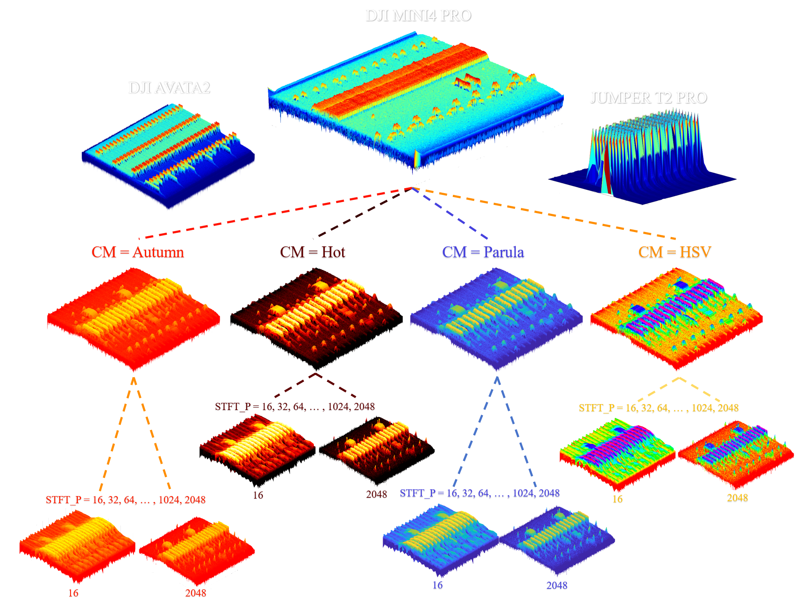

<h1 style="text-align:center;"> The RFUAV DATASET </h1>

## Abstract

The official repository for our paper, *"[RFUAV: A Benchmark Dataset for Unmanned Aerial Vehicle Detection and Identification](https://arxiv.org/abs/2503.09033)"*, can be accessed here. RFUAV offers a comprehensive benchmark dataset for Radio-Frequency (RF)-based drone detection and identification.
  


In addition to the dataset, we provide the raw data used to generate the spectral information, which includes recordings from 35 different types of drones under high signal-to-noise ratio (SNR) conditions. This dataset is available to all researchers working with RF data for drone analysis. Researchers can apply the deep learning methods we have provided, or use traditional signal processing techniques such as decoding, demodulation, and FFT.

Detailed information about the dataset, including file sizes (total data volume for each drone), SNR (the highest SNR for each dataset), and the middle frequency (the central frequency used during data collection for each drone), is provided in the figure below.

  

We analyzed the properties of each drone in the dataset, including Frequency Hopping Signal Bandwidth (FHSBW), Frequency Hopping Signal Duration Time (FHSDT), Video Transmitted Signal Bandwidth (VSBW), Frequency Hopping Signal Duty Cycle (FHSDC), and Frequency Hopping Signal Pattern Period (FHSPP). The distributions of these properties are plotted below. More detailed information can be found in our paper.

  

With RFUAV, you can achieve drone signal detection and identification directly on raw IQ data, as demonstrated below:
    <div style="text-align:center;">
        
    </div>

## 1. Quick Start
<details>
<summary>Installation</summary>

```bash
pip install -r requirements.txt
```

</details>

<details>
<summary>Run inference for drone classification</summary>

```bash
python inference.py
```

</details>

<details>
<summary>Quick training using ResNet50 on a small dataset</summary>

```bash
python train.py
```

</details>

## 2. Usage

### SDR Playback
Since our data was directly collected using USRP devices, it is fully compatible with USRP and GNU Radio for signal replay. You can use our raw data to broadcast signals through radio equipment to achieve your desired outcomes. Additionally, we provide the replay results observed during our experiments using an oscilloscope for reference.
    <div style="text-align:center;">
        
    </div>

### 2.1 Converting Raw Frequency Signal Data to Spectrograms

#### Python Pipeline

We provide a signal processing pipeline to convert binary raw frequency signal data into spectrogram format using both MATLAB and Python toolboxes.

**Visualize Spectrograms**

You can easily visualize the spectrogram of a specific data pack using the following code. The `oneside` parameter controls whether to display the half-plane or full-plane spectrogram.

```python
from graphic.RawDataProcessor import RawDataProcessor

datapack = 'Your datapack path'
test = RawDataProcessor()
test.ShowSpectrogram(data_path=datapack,
                     drone_name='DJ FPV COMBO',
                     sample_rate=100e6,
                     stft_point=2048,
                     duration_time=0.1,
                     oneside=False,
                     Middle_Frequency=2400e6)
```

**Batch Conversion to Images**

To automatically convert raw frequency signal data into spectrograms and save them as PNG images:

```python
from graphic.RawDataProcessor import RawDataProcessor

data_path = 'Your datapack path'
save_path = 'Your save path'
test = RawDataProcessor()
test.TransRawDataintoSpectrogram(fig_save_path=save_path,
                                 data_path=data_path,
                                 sample_rate=100e6,
                                 stft_point=1024,
                                 duration_time=0.1)
```

**Save as Video**

You can use the `TransRawDataintoVideo()` method to save the spectrogram as a video, which provides better visualization of temporal signal evolution:

```python
from graphic.RawDataProcessor import RawDataProcessor

data_path = 'Your datapack path'
save_path = 'Your save path'
test = RawDataProcessor()
test.TransRawDataintoVideo(save_path=save_path,
                           data_path=data_path,
                           sample_rate=100e6,
                           stft_point=1024,
                           duration_time=0.1,
                           fps=5)
```

**Waterfall Spectrogram**

The `waterfall_spectrogram()` function converts raw data into a waterfall spectrogram video, visually displaying how the signal evolves over time:

```python
from graphic.RawDataProcessor import waterfall_spectrogram

datapack = 'Your datapack path'
save_path = 'Your save path'
images = waterfall_spectrogram(datapack=datapack,
                               fft_size=256,
                               fs=100e6,
                               location='buffer',
                               time_scale=39062)
```

#### MATLAB Pipeline

You can use the `check.m` program to visualize the spectrogram of a specific data pack:

```matlab
data_path = 'Your datapack path';
nfft = 512;
fs = 100e6;
duration_time = 0.1;
datatype = 'float32';
check(data_path, nfft, fs, duration_time, datatype);
```

### 2.2 SNR Estimation and Adjustment

We provide SNR estimation and adjustment tools using the MATLAB toolbox to help you analyze and process binary raw frequency signal data.

**SNR Estimation**

First, locate the signal position and estimate the SNR:

```matlab
[idx1, idx2, idx3, idx4, f1, f2] = positionFind(dataIQ, fs, bw, NFFT);
snr_esti = snrEsti(dataIQ, fs, NFFT, f1, f2, idx1, idx2, idx3, idx4);
```

**SNR Adjustment**

The `awgn1` function adjusts the noise level of raw signal data based on the SNR estimation results. The signal-to-noise ratio can be adjusted between -20 dB and 20 dB, with a default step size of 2 dB. You can also define a custom scale if needed.

### 2.3 Training Custom Drone Classification Models

We provide custom training code for drone identification tasks based on the PyTorch framework. Currently supported models include [ViT](https://arxiv.org/abs/2010.11929), [ResNet](https://arxiv.org/abs/1512.03385), [MobileNet](https://arxiv.org/abs/1704.04861), [Swin Transformer](https://arxiv.org/abs/2103.14030), [EfficientNet](https://arxiv.org/abs/1905.11946), [DenseNet](https://arxiv.org/abs/1608.06993), [VGG](https://arxiv.org/abs/1409.1556), and many others. You can also customize your own model using the code in `utils.trainer.model_init_()`.

**Training**

To customize the training, create or modify a configuration file with the `.yaml` extension and specify its path in the training code. You can adjust the arguments in `utils.trainer.CustomTrainer()` to achieve the desired training setup:

```python
from utils.trainer import CustomTrainer

trainer = CustomTrainer(cfg='Your configuration file path')
trainer.train()
```

Alternatively, you can use the base trainer directly:

```python
from utils.trainer import Basetrainer

trainer = Basetrainer(
    model='resnet50',
    train_path='Your train data path',
    val_path='Your val data path',
    num_class=23,
    save_path='Your save path',
    weight_path='Your weights path',
    device='cuda:0',
    batch_size=32,
    shuffle=True,
    image_size=224,
    lr=0.0001
)
trainer.train(num_epochs=100)
```

**Inference**

We provide an inference pipeline that allows you to run inference on either spectrogram images or binary raw frequency data. When processing binary raw frequency data, the results are automatically packaged into a video with identification results displayed on the spectrogram. **Note:** When inferring on binary raw frequency data, you must use a model weight trained on the spectrogram dataset.

```python
from utils.benchmark import Classify_Model

test = Classify_Model(cfg='Your configuration file path',
                      weight_path='Your weights path')

test.inference(source='Your target data path',
               save_path='Your target save path')
```

### 2.4 Training Custom Drone Detection Models

We provide custom training methods for drone detection tasks. Currently supported models include [YOLOv5](https://github.com/ultralytics/yolov5). 

**Training**

You can train the YOLOv5 model for drone detection using the following code:

```python
from utils.trainer import DetTrainer

model = DetTrainer(cfg='Your configuration file path', dataset_dir = "Your dataset file path")
model.train()
```

**Inference**

The inference pipeline allows you to run your model on either spectrogram images or binary raw frequency data. When processing binary raw frequency data, the results are automatically packaged into a video with detection results displayed on the spectrogram. **Note:** When inferring on binary raw frequency data, you must use a model weight trained on the spectrogram dataset.

```python
from utils.benchmark import Detection_Model

test = Detection_Model(cfg='Your configuration file path',
                       weight_path='Your weights path')
test.inference(source='Your target data path',
               save_dir='Your target save path')
```

### 2.5 Two-Stage Detection and Classification

We provide a two-stage pipeline that combines detection and classification: the first stage detects drone signals, and the second stage classifies the detected signals. You can process raw data packs directly, and the results will be saved as a video with both detection and classification annotations.

```python
from utils.TwoStagesDetector import TwoStagesDetector

cfg_path = '../example/two_stage/sample.json'
TwoStagesDetector(cfg=cfg_path)
```

**Note:** You should specify the configuration file in `.json` format. In the configuration file, you can customize the models used in both the detection and classification stages to achieve better performance. The pipeline supports optimized parallel processing with data reuse for efficient raw data processing.

### 2.6 Model Evaluation on Benchmark

You can evaluate your model on the benchmark using metrics such as mAP, Top-K Accuracy, F1 score (macro and micro), and the Confusion Matrix. The evaluation is performed separately on datasets with SNR levels ranging from -20 dB to 20 dB, and the final model performance is reported across different signal-to-noise ratios.

```python
from utils.benchmark import Classify_Model

test = Classify_Model(cfg='Your configuration file path',
                      weight_path='Your weights path')

test.benchmark()
```

### 2.7 Useful Tools for Dataset Processing

**Data Segmentation**

You can directly access our raw data for processing as needed. We provide a MATLAB tool (`tools/rawdata_crop.m`) for segmenting the raw data. You can specify any segment of raw data to be split at regular intervals (e.g., every 2 seconds). The segmented data packets are smaller and easier to process.

**Data Augmentation**

The benchmark includes drone images under various SNR levels, while the training set only contains drone image data at its original SNR. Using the training set directly may result in poor model performance on the benchmark. To address this, we provide a data augmentation tool (`utils.preprocessor.data_augmentation`) to enhance the model's accuracy and robustness:

```python
from utils.preprocessor import data_augmentation

data_path = "Your dataset path"
output_path = "Your output path"
method = ['Aug_method1', 'Aug_method2', ...]

data_augmentation(dataset_path=data_path,
                  output_path=output_path,
                  methods=method)
```

## 3. Notice

### 3.1 Raw Data Parameter Description

The publicly available dataset is currently a subset, which includes 37 drone raw data clips and corresponding image data used in our experiments.

The parameters of the USRP configured during data acquisition for each drone type are documented in corresponding `.xml` files. The following parameters are included:

- **`DeviceType`**: The acquisition device type
- **`Drone`**: The drone type/model
- **`SerialNumber`**: The serial number of the drone data pack
- **`DataType`**: The data type of raw data
- **`ReferenceSNRLevel`**: The signal-to-noise ratio of the drone data pack
- **`CenterFrequency`**: The center frequency of the drone data pack
- **`SampleRate`**: The sampling rate of the drone data pack
- **`IFBandwidth`**: The bandwidth of the drone data pack
- **`ScaleFactor`**: The hardware power amplification scale used when collecting signals (in dB) 
### 3.2 Dataset File Structure
Your dataset file structure should be organized as follows if you are using the provided dataloader.  
Dataset  
├── train  
│ ├── AVATA  
│ │ └── imgs  
│ └── MINI4  
│ &nbsp;&nbsp;&nbsp;&nbsp;└── imgs  
└── valid  
&nbsp;&nbsp;&nbsp;├── AVATA  
&nbsp;&nbsp;&nbsp;│ └── imgs  
&nbsp;&nbsp;&nbsp;└── MINI4  
&nbsp;&nbsp;&nbsp;&nbsp;&nbsp;&nbsp;&nbsp;└── imgs  
## 4. Dataset Download


The raw data, spectrograms, and model weights used in this study are now publicly available on [Hugging Face](https://huggingface.co/datasets/kitofrank/RFUAV).

For those interested in the detection dataset, a curated [subset](https://app.roboflow.com/rui-shi/drone-signal-detect-few-shot/models) is also provided on Roboflow, which can serve as a useful reference. The dataset can be automatically downloaded during training if the data path is not specified (see Section 2.3).


## Citation

    @misc{shi2025rfuavbenchmarkdatasetunmanned,
          title={RFUAV: A Benchmark Dataset for Unmanned Aerial Vehicle Detection and Identification}, 
          author={Rui Shi and Xiaodong Yu and Shengming Wang and Yijia Zhang and Lu Xu and Peng Pan and Chunlai Ma},
          year={2025},
          eprint={2503.09033},
          archivePrefix={arXiv},
          primaryClass={cs.RO},
          url={https://arxiv.org/abs/2503.09033}, 
    }
